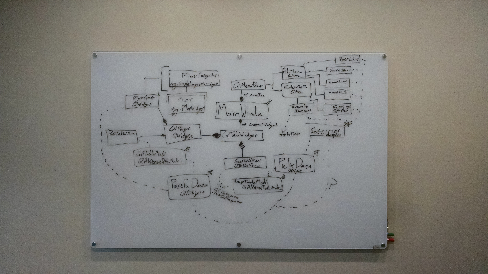
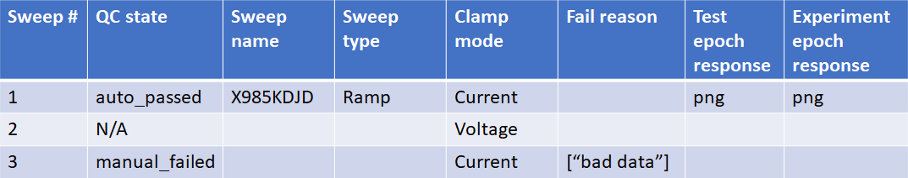

# sweep QC tool design

## summary

Intracellular electrophysiologists (icephys) would like a desktop GUI application for QCing their data. We will build this using PyQt5.

## background

Icephys experiments are conduction by patching a single cell, clamping its current (or voltage for certain QC purposes), providing stimulation, and recording responses. The stimuliation is patterned current / voltage. A presentation of a stimulus with particular parameters (e.g. a long square wave at `x` pA) along with the response is called a **sweep**.

Sweeps can go wrong. We have some automated tools for detecting bad sweeps, but they still require manual validation. That is the purpose of this app. Scientists would like to be able to look at characteristics and plots of individual sweeps, along with characteristics of the whole cell, and decide whether each sweep is good or not. The results of that decision should be used by downstream processing stages. The primary such stage is **feature extraction**.

The icephys pipeline is organized into three components, each implemented in a Python package called `ipfx`. These are:
- **sweep extraction**: sweeps need to be organized from the NWB2 file describing an experiment
- **automatic qc**: each sweep is assigned a qc state based on automated criteria
- **feature extraction**: a set of cell-scale features are calculated. Only sweeps that have passed QC (automatic and manual) are included.

We need to present results from all three stages to users of the sweep QC tool. 

see also [the confluence page](http://confluence.corp.alleninstitute.org/display/PP/Sweep+QC+Tool).

## goals

- can load ipfx experiments:
    - from NWB2 files (ipfx dispatches an appropriate reader based on detected NWB version, so NWB2 will also be supported)
    - from LIMS
- can load ancillary files
    - stimulus ontology from file
    - manual qc results from file
- can set detailed settings for ipfx stages
- can view help 
    - for the sweep qc tool
    - for ipfx
- can save/post manual sweep qc results:
    - to json
    - to LIMS
        - sets off a LIMS job for feature extraction
- displays two tabs
    - sweep tab: a table describing sweeps.
        - has columns:
            - auto_qc_state
            - manual_qc_state (editable dropdown)
                - not qced (output will default to auto qc result)
                - passed
                - failed
            - sweep_name
            - sweep_type
            - clamp_mode
            - fail tag
            - test_epoch_response: V/t during test epoch (only for current clamp). See `ipfx.plot_qc_figures.plot_sweep_figures`
            - experiment_epoch_response: V/t during experiment epoch (only for current clamp). See `ipfx.plot_qc_figures.plot_sweep_figures`
        - users can update the manual qc state associated with each sweep. Options:
    - cell tab: Describes the whole cell. Has two vertical components
        - cell features table: a mapping of cell-scales features to values obtained from that cell.
        - cell plots space: Contains many plot groups. Each plot group displays an array of related plots
- is easily installed on windows

## non-goals

nice to have:
- threading feature extraction. We could have feature extraction (the most costly ipfx stage) recalculate in a separate thread whenever a user changes the sweep selection. Prior results could be stored in an lru cache. This would speed up the workflow and avoid the requirement that users manually refresh.
- nifty editing functionality (e.g. `ctrl-z`)
- nicer deployment (e.g. checking for updates)
- checkpointing. As planned here, the user must manually save

out of scope:
- functional updates to ipfx (though we may need to add entry points)
- no-extract option for state
    - passed, but don't include in feature extraction
    - downstream components don't know how to handle this now, so LIMS work is required
- must check ipfx version against pipeline
    - LIMS cannot see the ipfx version currently and so cannot describe it to the qc tool
- anything to do with existing QC report generation

## plan

### libraries

- PyQt5: Overall application framework. Selected because it has a large collection of widgets and good Python integration (which allows it to interface nicely with ipfx).
- ipfx: Produces data and plots we would like to display. Contains code for:
    1. extracting sweeps for an experiment
    2. performing automatic qc on an experiment
    3. calculating higher-order features of an experiment.
    4. plots figures
- fbs: packaging and deployment tool for PyQt5
- pyqtgraph: provides interactive graphing utilities embeddable as qt widgets.

### deployment

Builds are carried out on appveyor via `fbs freeze` when tags are pushed to master. If the build succeeds, the tag is promoted to a release and the resulting Windows executable posted to that release. Users are then responsible for downloading this 

### components
- `main_window: MainWindow`
    - initializes and attaches all other components.
    - The method `main_window.show()` is called in order to actually display the app
- `main_menu_bar: PyQt5.QtWidgets.QMenuBar`
    - Owns menus (e.g. File, Edit, Settings, Help, ...)
    - Belongs to the main window and is constructud / accessed via `main_window.menuBar()`
- `tabs: PyQt5.QtWidgets.QTabWidget`
    - Allows the user to swap between the sweep table view and the cell page (and owns these components via `insertTab`)
    - Is set as the `main_window.centralWidget`

underlying data:

- `settings: Settings`
    - Holds contextual information, like lims credentials ipfx version, and nwb paths. 
    - Contains methods called back from menu actions, (e.g.a dialog for loading a new file
    - Emits signals to `pre_fx_data` or `fx_data` when relevant settings change (e.g. if a new file is loaded, `pre_fx_data` becomes invalid).
- `pre_fx_data : PreFxData`
    - Data and workflow container for all pre-fx data
    - User data modifications from e.g. menu items (load a new nwb file) or sweep qc actions modify data here. 
    - Calculates and holds raw and derived data from sweep extraction and auto qc stages.
- `fx_data: FxData` 
    - Calculates and holds feature extraction results or unextracted state.
    - Extraction triggered manually via menu action.

views and helpers:

- `sweep_table_view: SweepTableView`
    - Displays a table of sweeps
    - uses an `SvgDelegate` (potentially might want a pyqtgraph renderer instead) to show plots
    - uses a `ManualQcDelegate` to allow users to QC sweeps.
- `sweep_table_model: SweepTableModel`
    - interface between `sweep_table_view` and `pre_fx_data` (which actually owns the data)
- `cell_page: PyQt5.QtWidgets.QtWidget`
    - lays out the features table and the cell plots using a `PyQt5.QtWidgets.QVBoxLayout`
- `features_table_view: PyQt5.QtWidgets.QTableView`
    - Simple display for cellwise features
    - read only
- `features_table_model: FeaturesTableModel`
    - interface between `features_table_view` and `fx_data`
- `cell_plots: CellPlots`
    - Owns and lays out `cell_plot_groups` using a `PyQt5.QtWidgets.QVBoxLayout`
    - Obtains data from `fx_data`
    - Conditionally constructs groups based on stimuli presented.
- `cell_plot_groups: pyqtgraph.GraphicsLayoutWidget`. Each one displays a set of plots (`pyqtgraph.PlotWidget`) describing cellwise characteristics (particularly stimulus responses). Examples:
    - cell_health_plots: A series of plots describing overall cell health vs sweep number. Uses `pre_fx_data`
        - bridge balance: bridge_balance_mohm
        - pre_vm: pre_vm_mv
        - leak: leak_pa
    - subthreshold_long_square_features: Plots describing response to long squares stimulus
        - subthreshold: a plot of stimulation current (pA) vs min membrane threshold (mV) on all long squares sweeps for which no spikes were emitted. Also includes best linear fit.
        - tau plot: membrane time constant (tau) vs. stimulation current (pA) scatter across sweeps (with mean).
        - sweep plots: same as experiment_epoch_response plots, with min voltage annotated. Probably don't need these here

### classes
- `MainWindow(PyQt5.QtWidgets.QMainWindow)`
- `Settings(PyQt5.QtCore.QObject)`
    - holds overall settings
    - maintains temporary directories
    - methods respond to menu actions
- `PreFxData(PyQt5.QtCore.QObject)`
    - runs sweep extraction and autoqc
    - holds:
        - dataset: EphysDataSet
        - stimulus_ontology_file: output file
        - default_resistance_parameters
            - seal_gohm: float
            - initial_access_resistance_nohm: float
            - manual_initial_input_mohm: float
        - cell:
            - blowout_mv: float
            - electrode0_pa: float
            - input_resistance_mohm: float
            - seal_gohm: float
            - initial_access_resistance: float
            - input_access_resistance: float
            - fail_tags: list of strings
            - failed_blowout: bool,
            - failed_electrode_0: bool,
            - failed_seal: bool,
            - failed_input_access_resistance: bool,
            - failed_qc: bool
        - sweep
            - sweep_number: int,
            - stimulus_units: str,
            - bridge_balance_mohm: float,
            - leak_pa: float,
            - stimulus_scale_factor: float,
            - stimulus_code: str,
            - stimulus_code_ext: str,
            - stimulus_name: str,
            - clamp_mode: str,
            - stimulus_start_time: float,
            - stimulus_amplitude: float,
            - stimulus_duration: float,
            - stimulus_interval: float,
            - pre_noise_rms_mv: float,
            - post_vm_mv: float,
            - post_noise_rms_mv: float,
            - pre_vm_mv: float,
            - slow_vm_mv: float
            - slow_noise_rms_mv: float,
            - vm_delta_mv: float
            - fail_tags: list of str,
            - qc_criteria: dict of criteria
            - auto_qc_state: one of {unset, passed, failed}
            - manual_qc_state: one of {unset, passed, failed}
- `FxData(PyQt5.QtCore.QObject)`
    - runs feature extraction
    - holds cell record: TODO: fill this in
- `SweepTableView(PyQt5.QtWidgets.QTableView)`
    - requires little implementation, other than to set custom delegates for some columns
- `SvgDelegate(PyQt5.QtWidgets.QStyledItemDelegate)`
    - renders svg in a table cell
    - should simple read svg as bytes from index.data
    - implement:
        - paint
- `ManualQcDelegate(PyQt5.QtWidgets.QStyledItemDelegate)`
    - provides an editable text dropdown for changing QC state
    - implement:
        - paint
        - createEditor
        - setEditorData
        - setModelData
        - updateEditorGeometry
- `SweepTableModel(PyQt5.QtCore.QAbstractTableModel)`
    - recieves communication from `PreFxData`
    - delegates data access to `PreFxData`
    - sends communication to `PreFxData` when qc states updated
    - implement:
        - rowCount
        - columnCount
        - data
        - headerData
        - flags
        - setData
- `FeaturesTableModel(PyQt5.QtCore.QAbstractTableModel)`
    - recieves communication from `FxData`
    - delegates data access to `FxData`
    - implement:
        - rowCount
        - columnCount
        - data
        - headerData
        - flags
        - setData
- `CellPlots(PyQt5.QtWidgets.QWidget)`

### stories

- A sweep state is manually updated:
    1. user selects a new value in the dropdown (on the `sweep_table_view`).
    2. The `sweep_table_view`'s `ManualQcDelegate`'s  `setModelData` method is called, and further calls `setData` on the `sweep_table_model`. 
    3. The `sweep_table_model` forwards this change to the `pre_fx_data`, which emits `manualQcChanged`.
    4. The `fx_data`'s validity becomes False and it emits `fxInvalidated`
    5. Save becomes disabled
    6. Refresh becomes enabled
    7. When the user presses refresh, feature extraction is run. When completed, the `fx_data` becomes valid and emits `fxValid`.

- The user saves data to LIMS
    1. The user selects File -> export to LIMS. This triggers the export to lims `QAction`, which is registered to `Settings.export_to_lims` 
    2. If a refresh is needed (`settings` was notified by `fx_data` when it became valid / invalid), a `QDialog` is opened prompting the user to 
        - continue
        - stop and refresh
        - stop
    3. `settings` checks for a lims host and LIMS credentials, as well as an experiment ID. If it does not find them, it opens a `QDialog` prompting the user to enter them.
    4. `settings` opens a `QDialog` asking the user to
        - review LIMS host
        - review experiment id
        - opt in to requesting that LIMS start a feature extraction job on successful post
    5. `settings `makes an http post request (or sql update depending on whether LIMS offers routes) updating the data.
    6. if the user asked to start an feature extraction job, `settings` requests reprocessing. If LIMS offered a convienience route this could be collapsed into 5.

### pictures

